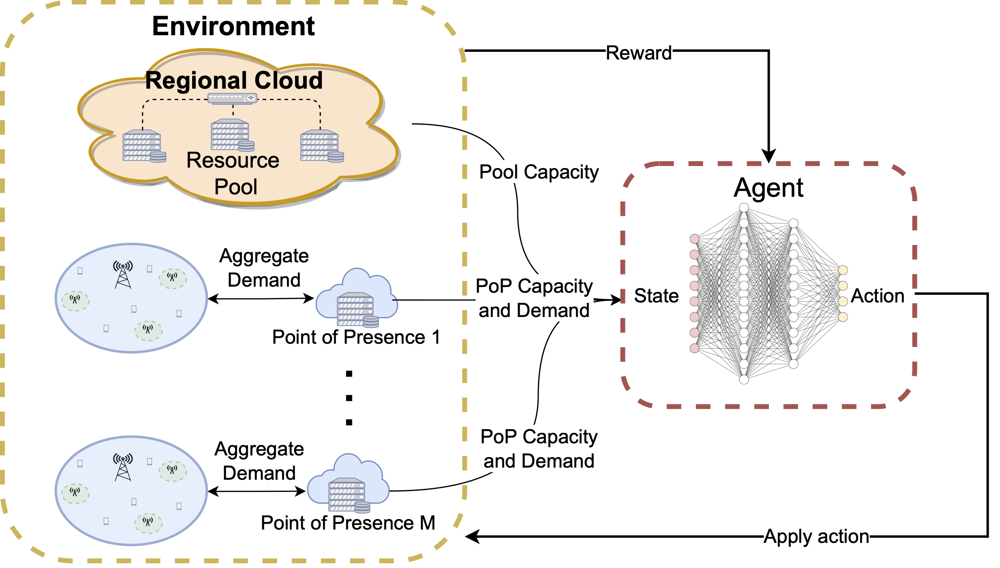

# PRORL Orchestrator  
**PRORL:** Proactive Resource Orchestrator for Open RANs Using Deep Reinforcement Learning

This repository contains the implementation of the PRORL framework, which leverages deep reinforcement learning for proactive resource management in Open RAN systems. The code supports multi-run scheduling, training, validation, and evaluation of the reinforcement learning agent.

---

## Table of Contents

- [Citation](#citation)
- [System Overview](#system-overview)
- [Contact](#contact)
- [Deployment](#deployment)
  - [Requirements](#requirements)
  - [Local Setup](#local-setup)
- [Running the Experiments](#running-the-experiments)
  - [1. Schedule a Multi-run Set](#schedule-a-multi-run-set)
  - [2. Training](#training)
  - [3. Validation](#validation)
  - [4. Evaluation](#evaluation)

---

## Citation

If you use this code in your work, please cite our paper:

```bibtex
@ARTICLE{StaffolaniPRORL2024,
  author    = {Staffolani, Alessandro and Darvariu, Victor-Alexandru and Foschini, Luca and Girolami, Michele and Bellavista, Paolo and Foschini, Mirco MusolesiLuca},
  journal   = {IEEE Transactions on Network and Service Management},
  title     = {PRORL: Proactive Resource Orchestrator for Open RANs Using Deep Reinforcement Learning},
  year      = {2024},
  volume    = {21},
  number    = {4},
  pages     = {3933-3944},
  keywords  = {Resource management, Optimization, Cloud computing, Reinforcement learning, Costs, Dynamic scheduling, Copper, O-RAN, reinforcement learning, resource allocation, multi-objective optimization},
  doi       = {10.1109/TNSM.2024.3373606}
}
```

---

## System Overview



---

## Contact

For questions or further information, please contact:  
`alessandro.staffolani@unibo.it`

---

## Deployment

### Requirements

- **Python:** Version 3.11
- **Docker:** Required to set up Redis and MongoDB instances.
- **Redis:** Used to monitor run progress. A Docker deployment is provided.
- **MongoDB:** Used to store run configurations and summary results. A Docker deployment is provided.

### Local Setup

1. **Clone the Repository:**

    ```bash
    git clone https://github.com/AlessandroStaffolani/prorl-orchestrator.git
    cd prorl-orchestrator
    ```

2. **Install Python Dependencies:**

    ```bash
    pip install -r requirements.txt
    ```

3. **Start Docker Compose:**

    The provided Docker Compose file sets up both Redis and MongoDB.

    ```bash
    docker compose -f docker/docker-compose.yml up -d
    ```

4. **Prepare the Dataset:**

    Follow the instructions in the [tim-dataset-pipeline](https://github.com/AlessandroStaffolani/tim-dataset-pipeline) repository to set up the necessary dataset.

---

## Running the Experiments

The repository supports scheduling runs, training, validation, and evaluation. Each of these processes is handled via the `prorl.py` command-line interface.

### Schedule a Multi-run Set

This command reads a configuration file and generates a set of runs. It stores the run configurations in MongoDB and enqueues a reference in Redis.

```bash
python prorl.py run scheduler multi-runs -mcp <config_file_path> -q <queue_name>
```

Replace `<config_file_path>` with the path to your configuration file and `<queue_name>` with the desired Redis queue name.

### Training

After scheduling the runs, execute the training runs. This command processes runs sequentially until the queue is empty. You can also start multiple workers in parallel to speed up execution.

```bash
python prorl.py run worker run-worker -p 0 --stop-empty -q <queue_name>
```

### Validation

Validation runs are used to test the performance of the agent on unseen data during training. Execute the following command to start the validation worker:

```bash
python prorl.py run worker val-run-worker -p 0 --stop-empty
```

### Evaluation

To evaluate the performance of the trained agent on an additional set of unseen data, run:

```bash
python prorl.py run worker eval-run-worker -p 0 --stop-empty
```
